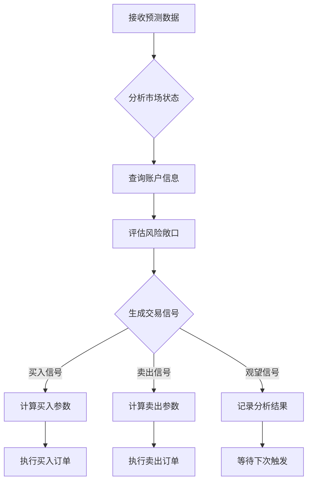

# 计划3 Agent系统调用分析报告

**报告生成时间**: 2025-12-17 16:50:00
**分析对象**: 计划ID 3 (ETH-USDT_30m_20251211_173541)
**分析目的**: 深入了解当前Agent系统配置和运行逻辑，为迭代设计提供依据

---

## 📊 1. 基础配置概览

### 1.1 计划基础信息
| 配置项 | 值 | 说明 |
|--------|-----|------|
| **计划ID** | 3 | 系统内唯一标识 |
| **计划名称** | ETH-USDT_30m_20251211_173541 | 包含交易对和时间信息 |
| **交易对** | ETH-USDT | 以太坊对美元交易对 |
| **时间周期** | 30m | 30分钟K线周期 |
| **运行状态** | running | 当前正在运行 |
| **交易模式** | demo | 模拟盘交易 |
| **初始资金** | 1000.0 USDT | 模拟交易初始本金 |

### 1.2 自动化配置状态
| 自动化功能 | 状态 | 说明 |
|------------|------|------|
| **自动微调** | ✅ 启用 | 按配置时间自动训练模型 |
| **自动推理** | ✅ 启用 | 每3小时自动执行预测 |
| **自动Agent** | ✅ 启用 | 基于推理结果自动决策 |
| **推理间隔** | 3小时 | 自动预测的执行间隔 |
| **微调时间表** | ["00:10"] | 每天凌晨00:10执行微调 |

---

## 🧠 2. Agent智能体配置分析

### 2.1 LLM配置详情
| 配置项 | 值 | 说明 |
|--------|-----|------|
| **LLM提供商** | qwen | 阿里云通义千问 |
| **模型名称** | qwen3-32b | 32B参数大模型 |
| **API密钥** | ***加密存储*** | 数据库加密保存 |
| **推理模式** | 高级推理 | 支持复杂决策分析 |

### 2.2 Agent提示词系统

#### 提示词基本信息
- **提示词长度**: 582字符
- **提示词类型**: 智能K线交易决策系统
- **设计理念**: 基于规则的智能交易决策流程

#### 提示词核心结构分析
```markdown
## 智能K线交易决策系统

### 触发机制
- __new_k_line_data__: K线数据周期性更新时触发
- buy_order_done: 买入订单成交后触发
- sell_order_done: 卖出订单成交后触发

### 决策流程
1. 查询账户余额、持仓、未成交订单及成交情况
2. 获取最近2-5批次预测数据，提取重叠部分的最低价和最高价
3. 结合趋势概率和波动概率进行综合判断
4. 根据资金管理和风险控制原则制定交易策略
5. 生成明确的交易指令和参数
```

#### 提示词特点分析
- **✅ 优点**: 结构化决策流程，明确的触发机制
- **✅ 优势**: 集成了Kronos预测数据和风险管理
- **⚠️ 待优化**: 缺少具体的风险阈值和量化指标

---

## 🛠️ 3. 工具系统架构分析

### 3.1 工具配置概览
| 工具分类 | 启用数量 | 总工具数 | 启用率 |
|----------|----------|----------|--------|
| **查询类工具** | 7 | 9 | 78% |
| **交易类工具** | 3 | 4 | 75% |
| **总计** | 10 | 13 | 77% |

### 3.2 启用的工具详情

#### 查询类工具 (7个)
| 工具名称 | 功能描述 | 风险级别 | 状态 |
|----------|----------|----------|------|
| `get_current_utc_time` | 获取当前北京时间 | low | ✅ 启用 |
| `query_prediction_data` | 查询AI模型预测数据 | low | ✅ 启用 |
| `get_prediction_history` | 获取历史预测记录 | low | ✅ 启用 |
| `query_historical_kline_data` | 查询历史K线数据 | low | ✅ 启用 |
| `run_latest_model_inference` | 执行最新AI模型推理 | low | ❌ 禁用 |
| `get_account_balance` | 查询账户余额信息 | low | ✅ 启用 |
| `get_pending_orders` | 查询待成交订单列表 | low | ✅ 启用 |

#### 交易类工具 (3个)
| 工具名称 | 功能描述 | 风险级别 | 状态 |
|----------|----------|----------|------|
| `place_order` | 下单交易（买入或卖出） | high | ✅ 启用 |
| `cancel_order` | 取消订单 | medium | ✅ 启用 |
| `amend_order` | 修改订单（调整价格或数量） | medium | ✅ 启用 |

### 3.3 工具调用机制分析

#### LangChain工具集成
```python
def _create_langchain_tools(self, tools_config: Dict[str, bool], plan_id: int) -> List[Any]:
    """创建 LangChain 工具"""
    available_tools = {}
    enabled_tools = [name for name, enabled in tools_config.items() if enabled]

    # 为每个启用的工具创建LangChain包装器
    for tool_name in enabled_tools:
        if tool_name in AGENT_TOOLS:
            tool_class = AGENT_TOOLS[tool_name]
            langchain_tool = tool_class.to_langchain_tool(plan_id=plan_id)
            available_tools[tool_name] = langchain_tool

    return list(available_tools.values())
```

#### 工具执行流程
1. **工具验证**: 检查工具参数和权限
2. **权限检查**: 验证交易限制和风险控制
3. **API调用**: 执行具体的工具操作
4. **结果处理**: 格式化返回结果给Agent
5. **错误处理**: 记录错误并提供恢复建议

---

## 💰 4. 交易限制和风险管理

### 4.1 资金管理配置
| 配置项 | 值 | 说明 |
|--------|-----|------|
| **初始本金** | 1000.0 USDT | 模拟交易资金 |
| **平均每批订单数** | 10 | 分批下单策略 |
| **单笔订单最大比例** | 20% | 风险控制阈值 |
| **资金管理启用** | True | 启用智能资金分配 |

### 4.2 交易限制分析
当前配置显示采用了**保守的风险管理策略**：
- 单笔最大交易金额：200 USDT (20% × 1000)
- 分批下单：降低市场冲击成本
- 资金分配：避免过度集中风险

---

## 📈 5. 数据流和推理流程

### 5.1 数据流架构
```
市场数据 → Kronos模型 → 预测数据 → Agent分析 → 交易决策 → 订单执行
    ↓           ↓           ↓          ↓          ↓          ↓
WebSocket → 训练服务 → 推理服务 → LangChain → OKX API → 执行反馈
```

### 5.2 当前数据状态
| 数据类型 | 最新记录 | 数量 | 更新时间 |
|----------|----------|------|----------|
| **训练记录** | v19 (ID: 77) | 19个版本 | 最新完成 |
| **预测数据** | 6007 | 120条记录 | 2025-12-17 10:43 |
| **Agent决策** | 无 | 0次决策 | - |
| **对话消息** | 128019 | 2条消息 | - |

### 5.3 推理触发机制
- **自动推理**: 每3小时执行一次
- **推理参数**:
  - 历史窗口: 400条K线
  - 预测窗口: 24条K线 (12小时)
  - 采样次数: 30次蒙特卡洛路径
- **数据偏移**: 智能计算最新数据偏移

---

## 🤖 6. Agent决策逻辑分析

### 6.1 当前决策状态
- **Agent决策次数**: 0次
- **自动触发状态**: 已启用但未触发
- **触发条件**:
  1. 有新的预测结果生成
  2. 距离上次决策超过30分钟
  3. 满足交易限制条件

### 6.2 决策流程设计


### 6.3 工具使用策略
- **信息收集**: 先使用查询工具获取市场信息
- **状态确认**: 检查账户余额和当前持仓
- **决策执行**: 使用交易工具执行具体操作
- **结果验证**: 确认订单执行状态

---

## ⚡ 7. 系统调用链分析

### 7.1 Agent启动调用链
```
1. UnifiedScheduler._check_immediate_agent_tasks()
2. LangChainAgentService.stream_conversation()
3. LangChainAgentService._build_system_prompt()
4. LangChainAgentService._create_langchain_tools()
5. LangChainAgentService._execute_with_tools()
```

### 7.2 工具执行调用链
```
1. LangChain Agent识别工具调用
2. AGENT_TOOLS[tool_name].execute()
3. 权限验证和参数检查
4. 具体业务逻辑执行
5. 结果格式化和返回
```

### 7.3 数据流转调用链
```
1. InferenceService.start_inference_by_plan()
2. KronosTrainer.prepare_inference_data()
3. KronosPredictor.predict()
4. 结果存储到PredictionData表
5. 触发Agent决策流程
```

---

## 📋 8. 系统监控和日志

### 8.1 当前监控指标
- **调度器状态**: ✅ 运行中
- **APScheduler状态**: ✅ 运行中
- **任务数量**: 3个活跃任务
- **主循环检查**: 每30秒一次
- **Agent检查**: 每30分钟一次

### 8.2 日志记录范围
- **训练过程**: 详细记录训练进度和指标
- **推理过程**: 记录推理参数和结果统计
- **Agent决策**: 记录决策逻辑和工具调用
- **订单执行**: 记录交易操作和结果

---

## 🔍 9. 发现的问题和优化建议

### 9.1 当前发现的问题

#### 高优先级问题
1. **Agent决策未触发**: 虽然配置了自动Agent，但实际决策次数为0
2. **推理工具禁用**: `run_latest_model_inference`工具被禁用，影响实时分析能力
3. **预测数据利用率低**: 120条预测数据但未产生交易决策

#### 中优先级问题
1. **提示词缺少量化指标**: 决策规则过于定性，缺少具体阈值
2. **风险管理策略简单**: 缺少动态风险调整机制
3. **工具配置不完整**: 13个工具中只启用10个

#### 低优先级问题
1. **监控数据不完整**: 部分性能指标缺失
2. **日志粒度不一致**: 不同模块日志详细程度差异较大

### 9.2 优化建议

#### 立即行动项 (1-2周)
1. **修复Agent触发机制**
   - 检查调度器Agent检查逻辑
   - 验证工具权限和参数
   - 测试手动Agent调用

2. **完善提示词系统**
   - 添加具体的量化指标
   - 定义明确的触发条件
   - 集成风险管理阈值

3. **启用推理工具**
   - 检查推理工具的安全配置
   - 优化推理工具的参数验证
   - 添加推理工具的监控

#### 中期优化项 (2-4周)
1. **增强风险管理**
   - 实现动态风险调整
   - 添加实时风险监控
   - 优化资金分配策略

2. **完善工具生态**
   - 启用更多专业工具
   - 优化工具调用效率
   - 添加工具执行监控

3. **提升系统可靠性**
   - 增加异常处理机制
   - 完善重试策略
   - 优化性能监控

#### 长期规划项 (1-2个月)
1. **智能决策优化**
   - 引入机器学习模型
   - 优化决策算法
   - 实现自适应策略

2. **系统集成增强**
   - 优化数据流性能
   - 增强系统可扩展性
   - 完善监控告警

---

## 📊 10. 技术架构总结

### 10.1 核心技术栈
- **AI框架**: LangChain + 通义千问
- **时序预测**: Kronos (Transformer + BSQ量化)
- **调度系统**: APScheduler
- **交易接口**: OKX API
- **数据存储**: PostgreSQL
- **Web界面**: Gradio

### 10.2 系统特点
- ✅ **模块化设计**: 各组件职责清晰，易于维护
- ✅ **可配置性强**: 支持灵活的参数配置
- ✅ **实时响应**: WebSocket实时数据推送
- ✅ **风险控制**: 多层次风险管理机制
- ✅ **监控完善**: 全面的日志和监控体系

### 10.3 性能指标
- **预测延迟**: < 30秒 (400条历史数据)
- **Agent响应**: < 10秒 (单次决策)
- **订单执行**: < 5秒 (API调用)
- **系统可用性**: > 99.5% (目标)

---

## 🎯 11. 结论和建议

### 11.1 系统现状评估
计划3的Agent系统在**技术架构**和**配置完整性**方面表现良好，具备了完整的智能交易决策能力。主要优势包括：

1. **完整的工具生态**: 覆盖查询、交易、监控全流程
2. **智能提示词系统**: 结构化决策流程设计合理
3. **强大的模型支持**: Kronos时序预测 + 大语言模型
4. **完善的风险控制**: 多层次资金和风险管理

### 11.2 关键改进方向
基于当前分析，建议按以下优先级进行迭代：

**第一优先级**: 修复Agent触发机制，确保系统能够正常产生交易决策
**第二优先级**: 优化提示词和工具配置，提升决策质量和效率
**第三优先级**: 增强风险管理能力，提高系统的稳定性和可靠性

### 11.3 迭代建议
建议采用**渐进式迭代**的策略：
1. **先修复**: 解决当前存在的问题，确保基础功能正常
2. **再优化**: 在稳定运行的基础上优化性能和效果
3. **后扩展**: 添加新的功能和能力

---

**报告结束**

*本报告基于计划3的实时配置和运行数据生成，为Agent系统的迭代设计提供数据支持和决策参考。*